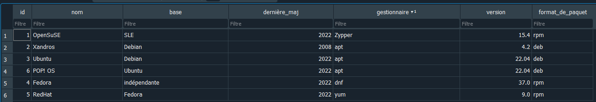

# Ce que j'ai appris à partir de DB browser

## Commandes de base

### Créer une table :

CREATE TABLE NOM_DE_TABLE (id INT, attributs, PRIMARY KEY (id))

*exemple :*

`CREATE TABLE DISTRIBUTIONS (id INT, nom TEXT, base TEXT, dernière_maj INT, gestionnaire de paquets TEXT, version FLOAT, PRIMARY KEY (id))`

### Entrer des valeurs dans la table:

En fait, on entre des ensembles d'attributs.

`INSERT INTO NOM_DE_TABLE VALUES (attributs)`

*exemple :*

`INSERT INTO DISTRIBUTIONS (1, "OpenSuSE", "SLE", 2022, "Zypper", 15)`

### Afficher des éléments de la table :

***Tout*** afficher :

`SELECT * FROM NOM_DE_TABLE`

`*` comme partout veut dire ***tout***

**SELECT** sélectionne les attributs, FROM indique depuis quelle table.

En prenant en compte le précédent exemple, cela renverrait :

|   | id | nom      | base | dernière_maj | gestionnaire de paquets | version |
| --- | ---- | ---------- | ------ | --------------- | ------------------------- | --------- |
| 1 | 1  | OpenSuSE | SLE  | 2022          | Zypper                  | 15.4    |

Donc pour n'afficher que certaines colonnes :

`SELECT attributs FROM NOM_DE_TABLE`

*exemple :*

`SELECT nom, base FROM DISTRIBUTIONS` renverrait :

|   | id | nom      | base |
| --- | ---- | ---------- | ------ |
| 1 | 1  | OpenSuSE | SLE  |

À présent, prenons une table plus fournie :

On peut formuler des requêtes encore plus précises avec WHERE. Là où SELECT sélectionne les attributs, WHERE filtre les *valeurs*.

Donc pour filtrer :

`SELECT attributs FROM NOM_DE_TABLE WHERE attribut="ce qu'on veut"`

*exemple* :

`SELECT nom, base FROM DISTRIBUTIONS WHERE base='Debian'` renverra :

|   | id | nom     | base   |
| --- | ---- | --------- | -------- |
| 1 | 1  | Xandros | Debian |
| 2 | 2  | Ubuntu  | Debian |
